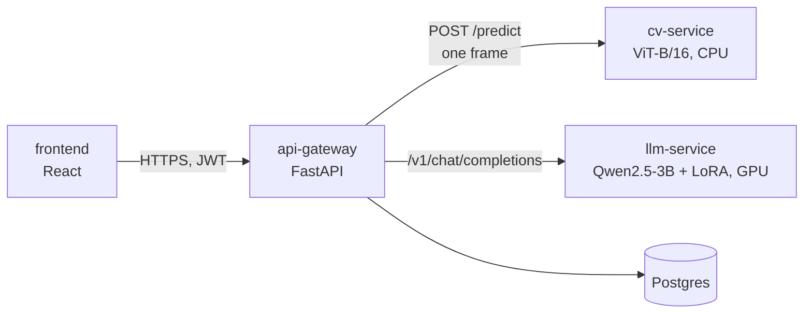

# Mirror architecture

One page to understand the system. Details live in the contracts linked below.

## Components



| Service | Owner | Contract |
|---|---|---|
| api-gateway | Mostafa | [api-gateway.openapi.yaml](contracts/api-gateway.openapi.yaml) |
| cv-service | Samuel | [cv-service.openapi.yaml](contracts/cv-service.openapi.yaml) |
| llm-service | Owen | [llm-service.openapi.yaml](contracts/llm-service.openapi.yaml) |
| (shared data shape) | all | [context_object.schema.json](contracts/context_object.schema.json) |

## One chat turn

1. While the camera is on, the frontend sends a frame every 1-2 s to `POST /sessions/{id}/frames`. The gateway asks the cv-service and keeps the result in a short window per session. Frames are never stored.
2. The patient sends text to `POST /sessions/{id}/messages`. The gateway then:
   1. runs the **safety check** on the text first. If it fires, it streams a `crisis` event (988), sets a review flag and stops;
   2. scores the text's tone;
   3. smooths and gates the visual window (`ok` / `uncertain` / `dropped` / `camera_off`);
   4. fuses both into one **context object** (validated against the schema);
   5. builds the prompt and calls the llm-service, streaming `token` events back, then `done`;
   6. stores the message and an aggregated emotion window (never raw frames).
3. The clinician dashboard reads aggregated windows and review flags (MS4).

If anything fails (camera off, cv-service down, low confidence, LLM timeout), the turn falls back to a plain text-only reply.

## Key design decisions

| Decision | Why |
|---|---|
| Contracts first (OpenAPI + JSON Schema) | Four people build in parallel against the same shapes; mistakes fail loudly |
| llm-service speaks the OpenAI chat format | vLLM provides it out of the box; the model server stays swappable |
| Prompt template lives in the gateway | The gateway owns the context object; the llm-service stays a plain model server |
| Chat replies stream as our own events (`crisis` / `token` / `done`) | One code path in the frontend for every outcome |
| Safety check is deterministic and text-only, before the LLM | The face model never triggers it; style tuning can weaken model refusals |

## Checking the contracts

```bash
uv run docs/contracts/validate.py
uvx --from openapi-spec-validator openapi-spec-validator docs/contracts/<file>.openapi.yaml
```

Changing a contract needs approval from every owner it affects.