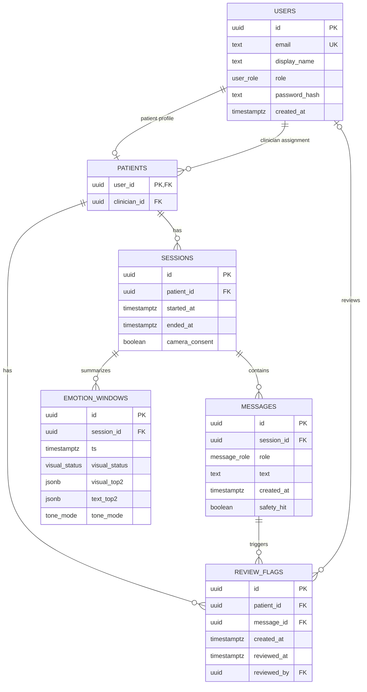

# Mirror data model

This document explains the PostgreSQL schema in `services/db/init.sql`. The SQL file is the executable source of truth. This document is the team-facing guide for design review, implementation, and oral-check preparation.

## Design rules

1. Store user, session, message, aggregate-affect, and review-flag data needed by the product.
2. Store only aggregate emotion summaries. Never store raw webcam frames, image paths, image URLs, blobs, or base64 images.
3. Keep safety review flags separate from model behavior. A review flag records that the deterministic text-only safety check fired.
4. Use foreign keys and constraints so invalid relationships are rejected by PostgreSQL.

## Entity relationship diagram



## Tables

| Table | Purpose | Important fields |
|---|---|---|
| `users` | Every login-capable person in the demo. | Unique email, role, password hash. |
| `patients` | Connects a patient user to one clinician. | `user_id`, `clinician_id`. |
| `sessions` | One period of patient conversation. | Patient, start/end times, camera consent. |
| `messages` | Patient, assistant, or system messages belonging to a session. | Role, text, safety hit marker. |
| `emotion_windows` | Aggregated signal summaries for clinician trends. | Visual status, top-two visual/text estimates, tone mode. |
| `review_flags` | Records messages needing clinician review. | Patient, triggering message, review timestamp, reviewing clinician. |

## Constraints and why they exist

| Constraint | Why it matters |
|---|---|
| Unique `users.email` | The M2-01 login contract identifies users by email. |
| User role enum | Only `patient` and `clinician` are valid account roles. |
| Message role enum | Only `patient`, `assistant`, and `system` messages can be stored. |
| Session foreign key | A message or emotion window cannot outlive its session. |
| Patient foreign key | Sessions and review flags always belong to a valid patient. |
| Review completion check | `reviewed_at` and `reviewed_by` must be both present or both absent. |
| JSONB top-two fields must be arrays | Emotion summaries retain a predictable structured form. |
| Patient role trigger | A `patients.user_id` must be a user with role `patient`. |
| Clinician role trigger | A `patients.clinician_id` must have role `clinician`; a reviewer must also be that patient's assigned clinician. |
| Referenced-role-change trigger | A user cannot change role while referenced by a patient profile, clinician assignment, or review flag. |
| Review-flag ownership trigger | A flagged message must belong to a session for the same patient named by the review flag. |
| Session-owner-change trigger | A session cannot change patient ownership after one of its messages has a review flag. |
| Flagged-message-move trigger | A flagged message cannot move to a session belonging to a different patient. |
| Flagged-message deletion rule | A review flag prevents deletion of its triggering message on its own. Deleting a patient cascades through the patient-owned records, including sessions, messages, and review flags, so the full patient deletion succeeds without leaving an orphaned flag. |
| No raw-frame table | Enforces the project rule that raw webcam data is never persisted. |

## Seed data

The initial database contains:

```text
2 clinicians
5 patients
5 clinician assignments
```

The seed IDs are fixed UUIDs. This makes later frontend, gateway, dashboard, and end-to-end tests reproducible.

## How later tasks use this schema

| Task | Uses |
|---|---|
| M2-14 API gateway v0 | Connects to the database service and later creates sessions/messages. |
| M3-07 deterministic crisis check | Sets `messages.safety_hit` and creates `review_flags`. |
| M3-10 chat endpoint | Persists messages and aggregated emotion windows after a chat turn. |
| M4-02 authentication | Uses `users.email`, `role`, and `password_hash`. |
| M4-03 clinician endpoints | Reads patient assignments, trends, and review flags. |
| M4-01 clinician dashboard | Displays patient trends and unresolved review markers. |
